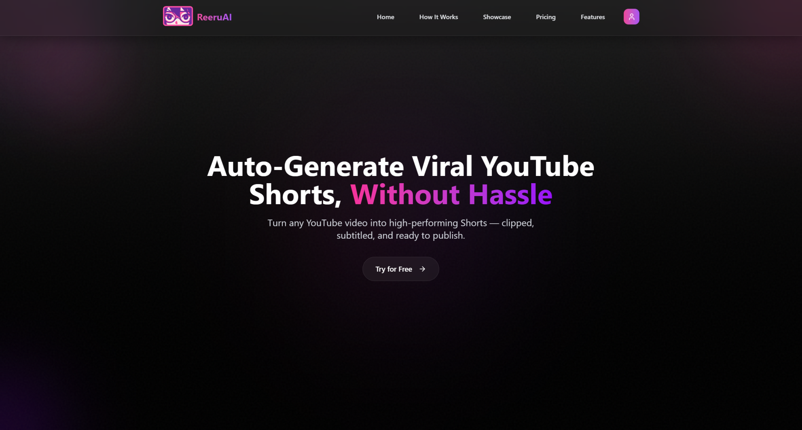
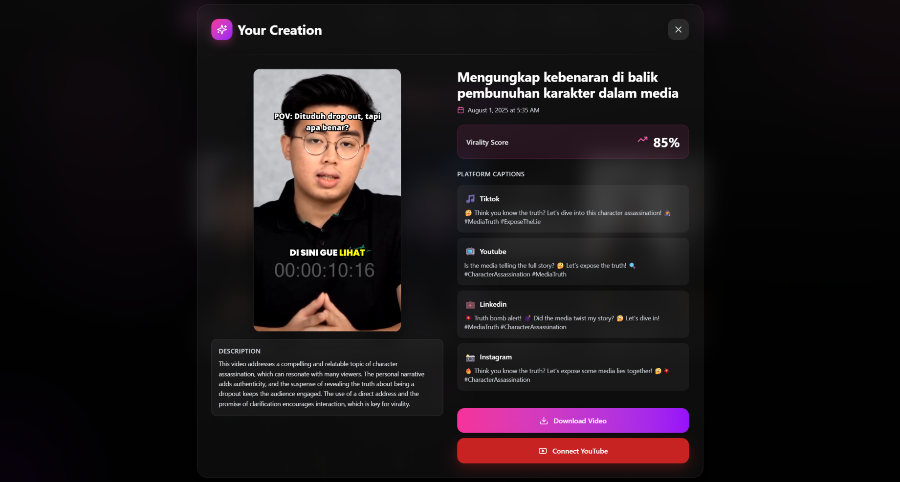
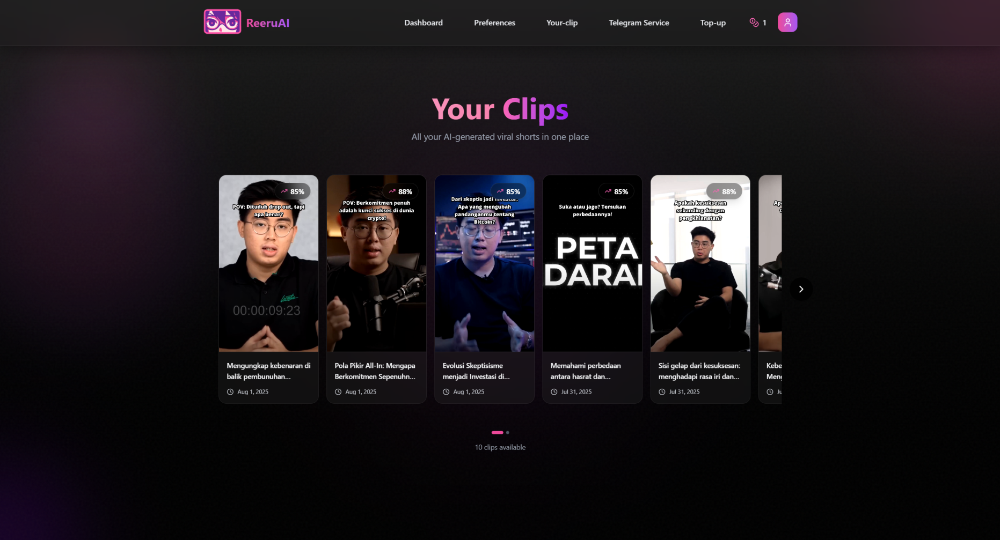
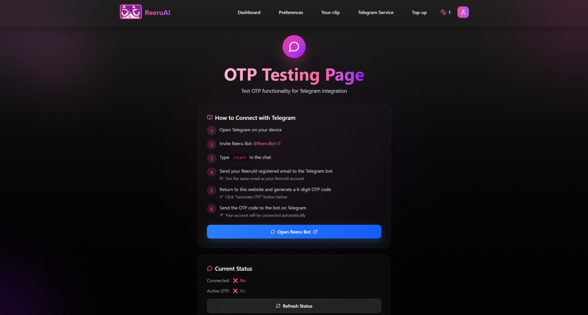
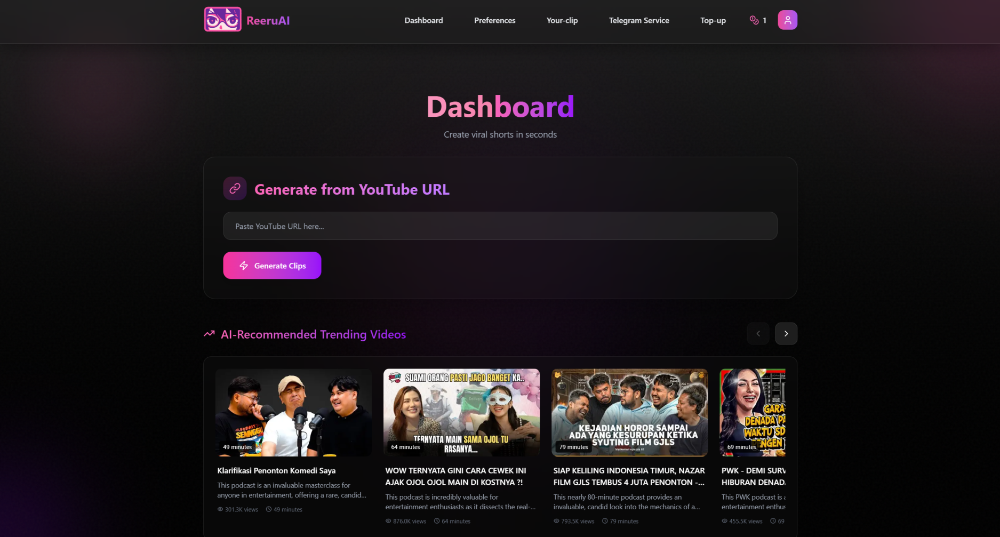
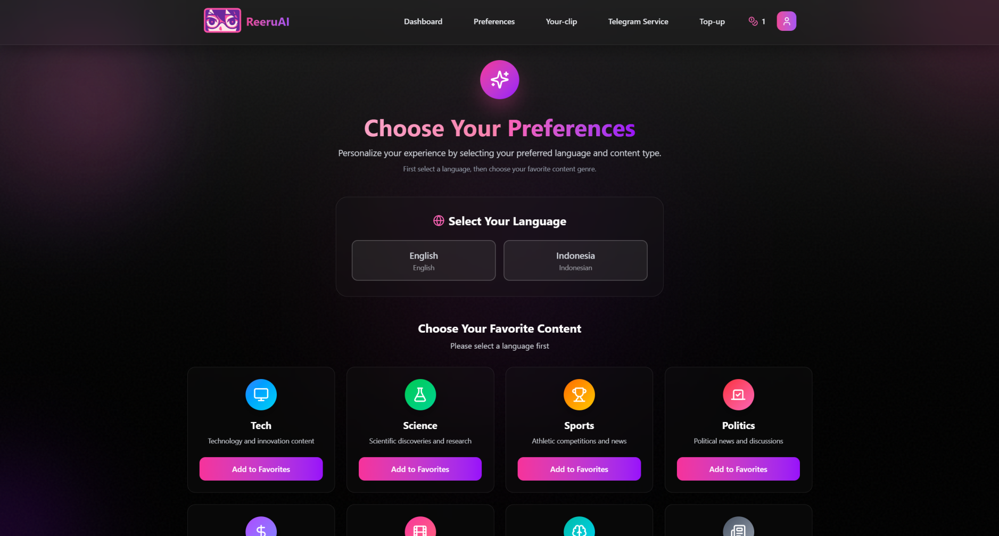

# ReeruAI

An AI-driven web application that automatically transforms long-form YouTube videos ( Podcasts > 1 hour ) into short, viral-ready clips.

Users simply paste a YouTube link, and ReeruAI handles everything including smart editing, auto-captioning, and trend analysis. The platform also provides daily trending video recommendations to keep creators relevant and includes seamless Telegram bot integration for managing tasks directly from chat.



## Features

- **AI-Powered Video Clipping**: Automatically extracts the most engaging segments from long videos
- **Smart Auto-Captioning**: Multi-language subtitle generation with perfect timing
- **Trend Analysis**: Daily personalized recommendations based on content preferences
- **Direct YouTube Publishing**: Upload shorts directly to your YouTube channel
- **Telegram Bot Integration**: Generate shorts and receive notifications via Telegram
- **Viral Score Analysis**: AI-powered virality prediction for each clip
- **Smart Notifications**: Stay updated with daily trend alerts
- **Token-Based Pricing**: Pay-as-you-grow model with no subscriptions




## Tech Stack

### Frontend

- **Next.js** - React framework with App Router
- **TypeScript** - Type-safe development
- **Tailwind CSS** - Utility-first CSS framework
- **Framer Motion** - Smooth animations and transitions
- **Zod** - Runtime type validation

### Backend

- **Node.js** - JavaScript runtime
- **MongoDB** - NoSQL database for user data and video metadata
- **Redis** - Caching and session management
- **JWT** - Authentication and authorization
- **Node-Cron** - Scheduled tasks for daily recommendations

### AI & APIs

- **Klap AI** - Video clipping and editing
- **Gemini API** - Content analysis and recommendations
- **YouTube Data API v3** - Video search and upload functionality
- **Google OAuth API** - Secure authentication
- **Telegram Bot API** - Chat-based interactions

### Infrastructure

- **Digital Ocean** - Cloud hosting
- **Axios** - HTTP client for API requests
- **Midtrans** - Payment processing

## Quick Start (Installation)

### Prerequisites

- Node.js 18+ and npm
- MongoDB database
- Redis server
- Google Cloud Console project
- Telegram Bot Token
- Klap AI API key
- Gemini API key

### 1. Clone the Repository

```bash
git clone https://github.com/yourusername/reeru-ai.git
cd elcondorpasa
```

### 2. Install Dependencies

```bash
npm install
```

### 3. Environment Setup

Copy the environment variables file and configure:

```bash
cp .env.example .env.local
```

### 4. Configure APIs

#### Google Cloud Console

1. Create a new project in [Google Cloud Console](https://console.cloud.google.com)
2. Enable YouTube Data API v3
3. Create OAuth 2.0 credentials
4. Add authorized redirect URIs

#### Telegram Bot

1. Message [@BotFather](https://t.me/botfather) on Telegram
2. Create a new bot with `/newbot`
3. Save the bot token

#### AI Services

1. Get Klap AI API key from [Klap](https://klap.app)
2. Get Gemini API key from [Google AI Studio](https://makersuite.google.com)

### 5. Database Setup

Start your MongoDB and Redis servers:

```bash
# MongoDB (if using local installation)
mongodb

# Redis (if using local installation)
redis-server
```

### 6. Run the Application

```bash
# Development mode
npm run dev

# Production build
npm run build
npm start
```

Visit `http://localhost:3000` to see the application.

## Environment Variables

Create a `.env.local` file in the root directory with the following variables:

```bash
# Database
MONGODB_URI=mongodb://localhost:27017/reeru-ai
REDIS_HOST=localhost

# Authentication
JWT_SECRET=your-super-secret-jwt-key-here

# Google APIs
GOOGLE_CLIENT_ID=your-google-client-id
NEXT_PUBLIC_GOOGLE_CLIENT_ID=your-google-client-id
YOUTUBE_CLIENT_ID=your-youtube-client-id
YOUTUBE_CLIENT_SECRET=your-youtube-client-secret
YOUTUBE_REDIRECT_URI=http://localhost:3000/api/youtube/callback
YOUTUBE_API_KEY=your-youtube-api-key

# AI Services
KLAP_API_KEY=your-klap-api-key
GEMINI_API_KEY=your-gemini-api-key

# Telegram
TELEGRAM_BOT_TOKEN=your-telegram-bot-token

# Payment (Midtrans)
MIDTRANS_SERVER_KEY=your-midtrans-server-key
NEXT_PUBLIC_MIDTRANS_CLIENT_KEY=your-midtrans-client-key

# Application
NEXT_PUBLIC_BASE_URL=http://localhost:3000
API_BASE_URL=http://localhost:3000
```

### Required API Keys

| Service            | Required | Purpose                  | Get From                                                 |
| ------------------ | -------- | ------------------------ | -------------------------------------------------------- |
| MongoDB URI        | ✅       | Database connection      | [MongoDB Atlas](https://cloud.mongodb.com)               |
| Redis Host         | ✅       | Caching and sessions     | [Redis Cloud](https://redis.com)                         |
| Google Client ID   | ✅       | OAuth authentication     | [Google Cloud Console](https://console.cloud.google.com) |
| YouTube API Key    | ✅       | Video search and upload  | [Google Cloud Console](https://console.cloud.google.com) |
| Klap API Key       | ✅       | AI video clipping        | [Klap](https://klap.app)                                 |
| Gemini API Key     | ✅       | Content analysis         | [Google AI Studio](https://makersuite.google.com)        |
| Telegram Bot Token | ✅       | Bot integration          | [@BotFather](https://t.me/botfather)                     |
| Midtrans Keys      | ⚠️       | Payment still in sandbox | [Midtrans](https://midtrans.com)                         |

## Project Structure

```
reeru-ai/
├── src/
│   ├── app/                    # Next.js App Router
│   │   ├── (withNavbar)/      # Protected routes with navigation
│   │   ├── api/               # API routes
│   │   └── page.tsx           # Landing page
│   ├── components/            # Reusable UI components
│   ├── db/                    # Database configuration
│   ├── helpers/               # Utility functions
│   ├── hooks/                 # Custom React hooks
│   ├── lib/                   # Core libraries
│   │   ├── telegramBot.ts     # Telegram bot logic
│   │   ├── gemini.ts          # AI recommendations
│   │   └── cronService.ts     # Scheduled tasks
│   ├── types/                 # TypeScript type definitions
│   └── middleware.ts          # Authentication middleware
├── public/                    # Static assets
├── .env.example              # Environment variables template
└── README.md                 # Project documentation
```

## Telegram Bot Usage

### Setup

1. Open Telegram and search for `@ReeruBot`
2. Send `/start` to begin
3. Send your ReeruAI registered email
4. Generate OTP from the web dashboard
5. Send the 6-digit code to complete linking

### Commands

- `/start` - Initialize bot and get setup instructions
- `/help` - Show available commands and features
- `/status` - Check connection status
- `/unlink` - Disconnect your account
- Send any YouTube URL to generate a short



## Daily Recommendations

ReeruAI provides personalized daily video recommendations based on:

- Your content preferences (Technology, Business, etc.)
- Language preference (English/Indonesian)
- Trending topics and viral potential
- View count and engagement metrics

The system uses Redis caching to ensure fresh content and avoid duplicates.





## API Endpoints

### Authentication

- `POST /api/auth/login` - User login
- `POST /api/auth/register` - User registration
- `POST /api/auth/logout` - User logout

### Video Processing

- `POST /api/klap` - Generate short from YouTube URL
- `GET /api/user-shorts` - Get user's generated shorts
- `POST /api/youtube/upload` - Upload short to YouTube

### Recommendations

- `GET /api/gemini` - Get personalized video recommendations
- `POST /api/preferences` - Update content preferences

### Telegram Integration

- `POST /api/telegram/generate-otp` - Generate linking OTP
- `POST /api/telegram/verify-otp` - Verify OTP code
- `GET /api/telegram/status` - Check connection status

## License

MIT License

Copyright (c) 2024 ReeruAI

The above copyright notice and this permission notice shall be included in all
copies or substantial portions of the Software.

---

## Support

- Telegram: [@ReeruBot](https://t.me/ReeruBot)

---

**Made in loving arms of El Condor Pasa**
